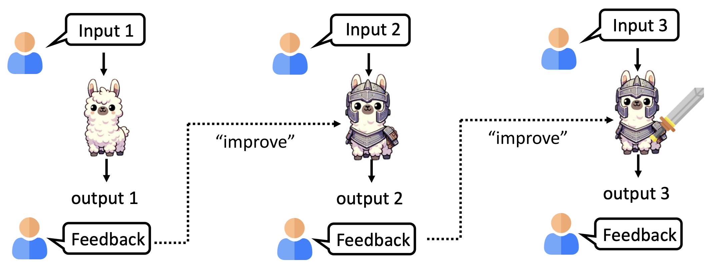
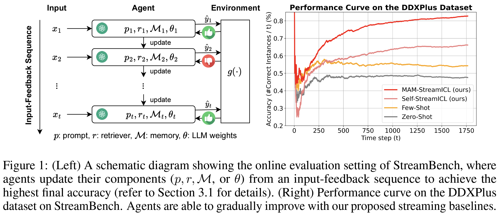

# StreamBench: Towards Benchmarking Continuous Improvement of Language Agents

**TL;DR:** We propose a pioneering benchmark to evaluate LLM agents' ability to improve over time in streaming scenarios

**Paper link:** https://arxiv.org/abs/2406.08747

**(New Feature)** Run with *OpenAI Batch API* to save cost! See the corresponding [section](#new-feature-run-the-main-script-with-openai-batch-api-mode) for how to use it. (**Note:** Only the non-streaming agents are supported.)


<p align="center"><em>Overview of StreamBench, illustrating the continuous improvement process of language agents in streaming scenarios. (Figure reference: <a href="https://www.chimechallenge.org/current/workshop/CHiME2024_Lee.pdf" target="_blank">CHiME 2024 Keynote @Interspeech</a>)</em></p>



## Steps to Reproduce the Experiments

### Install Required Packages
Run the following commands to install the requirements:
```
conda create -n stream_bench python=3.10
conda activate stream_bench
python -m pip install -r requirements.txt
```

### (Only for Text-to-SQL Datasets) Download SQL Data
For `Spider`, `CoSQL`, and `BIRD` datasets, one would need to download the SQL databases with the following command:
```
python download_text2sql_data.py
```
The script will download, unzip, and extract Text-to-SQL databases to the `./data` directory automatically.

### Setup Environment Variables
Depending on the method(s) to run, you might need to set the following API keys:
```
export OAI_KEY=<your_openai_api_key>
export GOOGLE_API_KEY=<your_google_ai_studio_api_key>
export ANTHROPIC_KEY=<your_anthropic_api_key>
```

### (Recommended) Sanity checking
Before running the main script with differnet baselines, one may want to check that the environment is correctly configured. This can be done by running the `GroundTruthAgent` on the dataset(s) and check whether the performance is 100%.
```
python -m stream_bench.pipelines.run_bench \
    --agent_cfg "configs/agent/gt.yml" \
    --bench_cfg "configs/bench/ds_1000.yml" \
    --entity "photocopier" \
    --use_wandb
```
In this example, we run the `GroundTruthAgent` on `DS-1000`. One may run on other datasets by replacing the `<dataset_name>.yml` file of the `--bench_cfg` argument.

### Run the Main Script
In this example, the `ZeroShot` baseline on the `DDXPlus` dataset is executed. Written scripts for running other datasets can be found in `./scripts`.
```
python -m stream_bench.pipelines.run_bench \
    --agent_cfg "configs/agent/zeroshot.yml" \
    --bench_cfg "configs/bench/ddxplus.yml" \
    --entity "photocopier" \
    --use_wandb
```
If you want to run other baselines on the dataset, you can modify `--agent_cfg` to different `<baseline_name>.yml` files, which are located in the `./configs/agent` folder.

### (New Feature) Run the Main Script with OpenAI Batch API mode
To save cost, you can run the main script with OpenAI Batch API mode as follows:
```
python -m stream_bench.pipelines.run_bench_batch \
    --agent_cfg "configs/agent/<agent_name>.yml" \
    --bench_cfg "configs/bench/<bench_name>.yml" \
    --entity "photocopier" \
    --use_wandb
```

### (Optional) Interactive Notebook
If you want a step-by-step walkthrough, please refer to `playground.ipynb`.

## Steps to Implement Your Own Methods
If you want to implement your own LLM agent, you may subclass the `Agent` base class in `./stream_bench/agents/base.py` and implement the following methods:

- `__init__`: Initialization of the agent (e.g., setting up LLMs and RAG pipelines).
- `__call__`: The inference logics of the agent. This should return the agent's prediction in string.
- `update`: The updating logics of the agent.

## Steps to Run Your Own LLMs
If you want to run agents with your own backbone LLMs, you have two options:

1. Using HuggingFace models: upload / choose your HuggingFace model, and set the configurations in `./configs/agent/<agent_name>.yml`. For example, if you want to run the zero-shot baseline with `google/gemma-2-2b-it`, set the configurations as follows:
```
agent_name: "zeroshot"
llm:
  series: "hf_model"
  model_name: "google/gemma-2-2b-it"
  temperature: 0.0
  max_tokens: 32
```

2. Others: for further customization, you can subclass the `LLM` base class in `./stream_bench/llms/base.py` and implement the following methods:

- `__init__`: Setup LLM configs here.
- `__call__`: Inference flows of prompting the LLM and get a tuple of (response_text, response_info). See the implementation of `./stream_bench/llms/oai_chat.py` and `./stream_bench/llms/hf_model.py` as examples.

## (Optional) StreamBench Datasets
If you want to download the datasets on StreamBench, we have collected the datasets on HuggingFace:
https://huggingface.co/datasets/appier-ai-research/StreamBench

These datasets have their original source webpages, please refer to our [paper](https://arxiv.org/abs/2406.08747) (Appendix F) for more details.

## Citation
If you find our work helpful, please cite as
```
@article{wu2024streambench,
  title={StreamBench: Towards Benchmarking Continuous Improvement of Language Agents},
  author={Wu, Cheng-Kuang and Tam, Zhi Rui and Lin, Chieh-Yen and Chen, Yun-Nung and Lee, Hung-yi},
  journal={arXiv preprint arXiv:2406.08747},
  year={2024}
}
```
